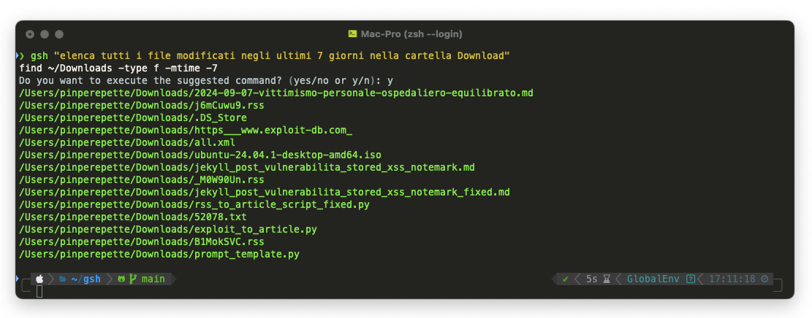
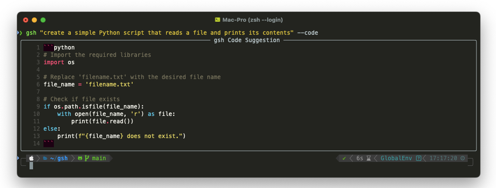

<p align="center">
  
</p>


# gsh (GPT Shell)

gsh (GPT Shell) is a Python tool that integrates OpenAI's GPT models directly into your shell, allowing users to execute complex commands and request code suggestions based on natural language input. It is designed to work across different systems such as macOS, Linux, and Windows, automatically adapting its behavior based on the detected platform.


## Features

- **Natural Language Command Execution**: Ask for shell commands in plain English (or other languages), and gsh will translate them into the appropriate shell commands for your system.
- **Code Suggestions**: Ask for Python code snippets or other programming-related suggestions, and gsh will generate high-quality code examples.
- **System Detection**: Automatically detects the operating system (macOS, Linux, Windows) and adjusts commands accordingly.
- **Secure API Key Handling**: Encrypts and securely stores your OpenAI API key locally.

## Prerequisites

To use gsh, you need to have an API key from OpenAI to access GPT models. This API key is **paid** and can be obtained from OpenAI's [API page](https://beta.openai.com/signup/).

- You will need a valid **OpenAI API key**, which will be used to make requests to the OpenAI API.
- **OpenAI GPT-4** requires a paid plan. For pricing information, please refer to the [OpenAI Pricing](https://openai.com/pricing/) page.


## Installation

1. Clone the repository from GitHub:
   ```bash
   git clone https://github.com/yourusername/gsh.git
   cd gsh
   ```

2. Install the dependencies:
   ```bash
   pip install -r requirements.txt
   ```

3. Alternatively, if you'd like to install it as a global tool:
   ```bash
   pip install .
   ```

4. Set up your OpenAI API key:

   Upon running `gsh` for the first time, you can pass your API key directly as an argument:
   ```bash
   gsh --api_key your-openai-api-key 'find all .txt files in the Documents folder'
   ```

   You will be asked to enter the key if not provided in the command line, and the key will be securely encrypted and stored in your home directory under `~/.config/gsh/api_key_encrypted.txt`.

   You can also set the environment variable `OPENAI_API_KEY` to your key directly:
   ```bash
   export OPENAI_API_KEY='your-api-key-here'
   ```

## Usage

### Basic Command

To run gsh with a natural language query, simply type:
```bash
gsh 'find all .txt files in the Documents folder'
```

If you're on macOS, for example, the command will be translated to:
```bash
find ~/Documents -name "*.txt"
```



### Code Suggestion

If you'd like a code suggestion instead of a shell command, use the `--code` flag:
```bash
gsh 'write a python function to calculate Fibonacci sequence' --code
```

This will generate a Python function suggestion, properly formatted with syntax highlighting.



### Example Commands

- **English**: `gsh 'list all files in my Downloads folder'`
  - Translated command: `ls ~/Downloads`

- **Italian**: `gsh 'elencami tutti i file .log nella cartella /var/log'`
  - Translated command: `find /var/log -name "*.log"`

### Managing API Keys

To securely manage your OpenAI API key, the first time you run `gsh`, you will be prompted to enter your key. This key is then stored encrypted in your home directory at `~/.config/gsh`.

If you'd like to change your key, simply remove the `api_key_encrypted.txt` file, and gsh will prompt you to enter a new key the next time it is run:
```bash
rm ~/.config/gsh/api_key_encrypted.txt
```

Alternatively, you can directly set the API key via environment variables:
```bash
export OPENAI_API_KEY='your-api-key-here'
```

### Example Uses

- **Search for installed applications**:
  ```bash
  gsh 'find the path of Google Chrome on macOS'
  ```

- **Code Example Request**:
  ```bash
  gsh 'write a Python function to reverse a string' --code
  ```

- **Update a system package**:
  ```bash
  gsh 'update oh-my-zsh' 
  ```

  Output:
  ```bash
  upgrade_oh_my_zsh
  ```

## Dependencies

gsh relies on the following libraries, which are automatically installed via `requirements.txt`:

- **openai**: For making requests to the OpenAI API.
- **rich**: For rich-text formatting in the terminal.
- **cryptography**: For securely encrypting and decrypting the OpenAI API key.
- **shutil**: For system command validation.

To install the required dependencies, run:

```bash
pip install -r requirements.txt
```

## License

This project is licensed under the MIT License. See the [LICENSE](./LICENSE) file for details.

## Contributions

Feel free to fork the project and create a pull request for any enhancements or bug fixes. Your contributions are welcome!

## Disclaimer

The API usage is subject to OpenAI's pricing model, and usage fees may apply. Please check the [OpenAI Pricing](https://openai.com/pricing) for more details.
